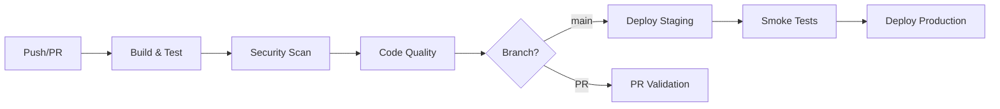

# CI/CD Pipeline Guide - Ergoplanner AI Suite

## Overview

The Ergoplanner AI Suite uses GitHub Actions for continuous integration and continuous deployment. Our pipeline ensures code quality, security, and reliable deployments across all environments.

## Pipeline Architecture



## Workflows

### 1. Main CI/CD Pipeline (`main.yml`)

**Triggers:**
- Push to `main` or `develop` branches
- Pull requests to `main` or `develop`
- Manual workflow dispatch

**Jobs:**
1. **Backend Build & Test**
   - Builds .NET Core application
   - Runs unit and integration tests
   - Generates code coverage reports
   - Minimum coverage: 80%

2. **Frontend Build & Test**
   - Builds Next.js application
   - Runs ESLint and TypeScript checks
   - Executes Jest tests
   - Builds production bundle

3. **ML Service Build & Test**
   - Validates Python code with Black and Flake8
   - Runs pytest with coverage
   - Type checking with mypy

4. **Docker Build**
   - Builds all Docker images
   - Uses BuildKit for optimized builds
   - Caches layers for faster builds

5. **Security Scanning**
   - Trivy container scanning
   - Gitleaks secret detection
   - Dependency vulnerability checks

6. **Deployment**
   - Automatic deployment to staging (main branch)
   - Manual deployment to production

### 2. PR Validation (`pr-validation.yml`)

**Triggers:**
- Pull request opened, synchronized, or reopened

**Checks:**
- Semantic PR title validation
- Automatic labeling by file type and size
- Code quality checks
- Coverage requirements
- Documentation validation
- Dependency license review

### 3. Security Analysis (`codeql-analysis.yml`)

**Triggers:**
- Push to main/develop
- Pull requests
- Weekly schedule (Monday 2 AM)

**Languages Analyzed:**
- C# (.NET Core)
- JavaScript/TypeScript
- Python

**Security Checks:**
- CodeQL extended security queries
- Quality and maintainability checks
- Vulnerability detection

### 4. Dependency Updates (`dependabot.yml`)

**Update Schedule:**
- Weekly on Monday at 3 AM

**Ecosystems:**
- NuGet (.NET)
- npm (Frontend)
- pip (Python)
- GitHub Actions
- Docker base images

**Configuration:**
- Auto-merge for minor updates
- Grouped updates for related packages
- Security updates prioritized

## Environment Configuration

### Staging Environment

```yaml
Environment: staging
URL: https://staging.ergoplanner.com
Auto-deploy: Yes (from main branch)
Approval: Not required
```

### Production Environment

```yaml
Environment: production
URL: https://ergoplanner.com
Auto-deploy: No
Approval: Required
Rollback: Automated on failure
```

## Secrets Management

### Required GitHub Secrets

```bash
# Authentication
GITHUB_TOKEN        # Automatically provided
PAT_TOKEN          # Personal access token for cross-repo access

# Docker Registry
DOCKER_USERNAME    # Docker Hub username
DOCKER_PASSWORD    # Docker Hub password

# Cloud Deployment
AZURE_CREDENTIALS  # Azure service principal
KUBE_CONFIG       # Kubernetes configuration

# Monitoring
SENTRY_DSN        # Error tracking
APP_INSIGHTS_KEY  # Application monitoring

# Notifications
SLACK_WEBHOOK     # Deployment notifications
```

### Setting Secrets

```bash
# Via GitHub CLI
gh secret set SECRET_NAME --body "secret_value"

# Via GitHub UI
Settings → Secrets and variables → Actions → New repository secret
```

## Branch Protection Rules

### Main Branch Protection

```yaml
Required status checks:
  - backend-build
  - frontend-build
  - ml-service-build
  - security-scan
  - code-quality

Requirements:
  - Require pull request reviews (1 approval)
  - Dismiss stale reviews
  - Require review from CODEOWNERS
  - Require branches to be up to date
  - Require conversation resolution
  - Require signed commits
  - Include administrators
```

## Quality Gates

### Code Coverage Requirements

| Component | Minimum Coverage | Target Coverage |
|-----------|-----------------|-----------------|
| Backend   | 80%             | 90%             |
| Frontend  | 80%             | 85%             |
| ML Service| 75%             | 85%             |

### Performance Benchmarks

| Metric | Maximum Allowed | Target |
|--------|----------------|--------|
| Build Time | 10 minutes | 5 minutes |
| Test Execution | 5 minutes | 3 minutes |
| Docker Build | 5 minutes | 3 minutes |
| Total Pipeline | 20 minutes | 12 minutes |

## Deployment Strategy

### Blue-Green Deployment

```yaml
Steps:
1. Deploy to green environment
2. Run smoke tests
3. Switch traffic to green
4. Monitor for 15 minutes
5. Keep blue as rollback option
6. Decommission blue after 24 hours
```

### Rollback Procedure

```bash
# Automatic rollback on failure
if health_check_fails:
  kubectl rollout undo deployment/ergoplanner

# Manual rollback
kubectl rollout undo deployment/ergoplanner --to-revision=2

# Via GitHub UI
Actions → Select workflow → Re-run with previous commit
```

## Monitoring & Notifications

### Build Status Badges

Add to README.md:
```markdown


```

### Slack Notifications

```yaml
on:
  workflow_run:
    workflows: ["Main CI/CD Pipeline"]
    types: [completed]

steps:
  - name: Slack Notification
    uses: 8398a7/action-slack@v3
    with:
      status: ${{ job.status }}
      webhook_url: ${{ secrets.SLACK_WEBHOOK }}
```

### Failure Notifications

Automatic notifications sent for:
- Build failures
- Test failures below coverage threshold
- Security vulnerabilities (HIGH/CRITICAL)
- Deployment failures
- Health check failures

## Local Testing

### Run GitHub Actions Locally

```bash
# Install act
brew install act  # macOS
choco install act  # Windows

# Run workflow
act -W .github/workflows/main.yml

# Run specific job
act -j backend-build

# With secrets
act --secret-file .env.secrets
```

### Pre-commit Hooks

```bash
# Install pre-commit
pip install pre-commit

# Install hooks
pre-commit install

# Run manually
pre-commit run --all-files
```

## Troubleshooting

### Common Issues

#### 1. Build Failures

```bash
# Check logs
gh run view <run-id> --log

# Re-run failed jobs
gh run rerun <run-id> --failed
```

#### 2. Coverage Drops

```bash
# Generate local coverage report
dotnet test --collect:"XPlat Code Coverage"
npm run test:coverage
pytest --cov

# View report
open coverage/index.html
```

#### 3. Docker Build Issues

```bash
# Clear cache
docker builder prune -a

# Build locally
docker build --no-cache .
```

#### 4. Deployment Failures

```bash
# Check deployment status
kubectl rollout status deployment/ergoplanner

# View logs
kubectl logs -l app=ergoplanner --tail=100

# Describe pods
kubectl describe pods -l app=ergoplanner
```

## Performance Optimization

### Speed Up Builds

1. **Use caching effectively**
```yaml
- uses: actions/cache@v3
  with:
    path: ~/.nuget/packages
    key: ${{ runner.os }}-nuget-${{ hashFiles('**/*.csproj') }}
```

2. **Parallelize jobs**
```yaml
strategy:
  matrix:
    service: [backend, frontend, ml-service]
```

3. **Use self-hosted runners for heavy workloads**
```yaml
runs-on: [self-hosted, linux, x64]
```

4. **Optimize Docker builds**
```dockerfile
# Use BuildKit
# syntax=docker/dockerfile:1
# Use cache mounts
RUN --mount=type=cache,target=/root/.cache/pip \
    pip install -r requirements.txt
```

## Best Practices

### 1. Commit Messages
Follow conventional commits:
```
feat(scope): add new feature
fix(scope): fix bug
docs(scope): update documentation
chore(scope): update dependencies
```

### 2. PR Guidelines
- Keep PRs small and focused
- Include tests for new features
- Update documentation
- Add screenshots for UI changes
- Link related issues

### 3. Security
- Never commit secrets
- Use environment variables
- Rotate secrets regularly
- Review security alerts promptly

### 4. Testing
- Write tests before fixing bugs
- Maintain coverage above threshold
- Test edge cases
- Use test containers for integration tests

## Maintenance

### Weekly Tasks
- Review and merge Dependabot PRs
- Check security alerts
- Review pipeline performance
- Update documentation

### Monthly Tasks
- Rotate secrets
- Review and optimize workflows
- Clean up old artifacts
- Update runner versions

### Quarterly Tasks
- Security audit
- Performance benchmarking
- Disaster recovery drill
- Documentation review

## Support

For CI/CD issues:
- Check workflow logs
- Review this documentation
- Contact DevOps team: devops@ergoplanner.com
- Create issue: https://github.com/ergoplanner/ergoplanner-suite/issues